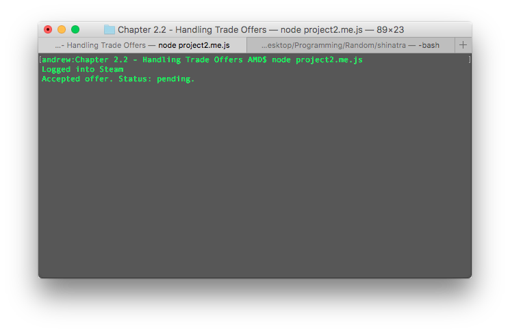
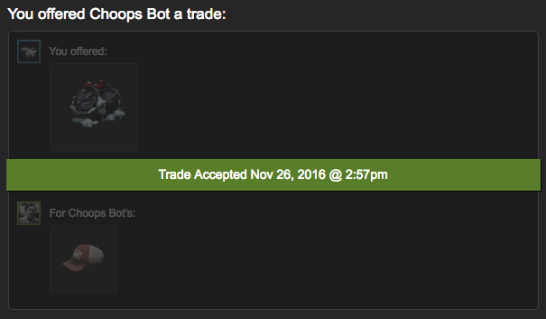

# Chapter 2.2 - Handling Trade Offers

To start off this chapter, let's duplicate the code we made in the previous
chapter to a new file. Call it `project2.js`. The code we wrote in Chapter 1
will be the code we use from now on to create all of our bots. It will be the
backbone for future bots we create.

Let's begin adding some code to the top of our project, copied from
`project1.js`.

```js
const SteamUser = require('steam-user');
const SteamTotp = require('steam-totp');
const SteamCommunity = require('steamcommunity');
const TradeOfferManager = require('steam-tradeoffer-manager');

const client = new SteamUser();
const community = new SteamCommunity();
const manager = new TradeOfferManager({
	steam: client,
	community: community,
	language: 'en'
});

[...]
```

Sweet. We `require`d two new modules, and created new instances for both of
them. In addition, we passed some extra parameters to the `TradeOfferManager`
module's constructor. We told it to use our `client` variable when it would
like to access Steam, and our `community` when it would like to access
the Steam Community. If we did not specify these options, a new instance of
these modules would be created inside of our `TradeOfferModule` instance, but we
provide our own so we can have more customizability in the future. We also tell
TradeOfferManager to use the English language so that we can get the English
names of items in the trade offers.

Let's add some more code while we're at it.

```js
client.on('webSession', (sessionid, cookies) => {
	manager.setCookies(cookies);

	community.setCookies(cookies);
	community.startConfirmationChecker(10000, 'your_identity_secret');
});
```

Here, we added a new event listener to the `client` instance. We're listening
for the `webSession` event, which is emitted when we get a session id and
cookies back from the Steam servers. Then, we pass those cookies to our
`manager` and `community`, which will allow them to be logged into Steam as
well. We also tell our `community` instance to start checking to see if we have
any pending confirmations every 10 second, and accept them if we do. This
requires you to enter your identity secret, which we address in [Chapter 1.4](../../Chapter 1 - Basics/Chapter 1.4 - TOTP/#how-to-find-your-secrets).

Sweet, so now we have our `manager`, `client` and `community` all
logged into Steam. Now let's try doing something with all this. We'll start by
accepting all incoming trade offers if they come from an account we trust.
Let's give it go.

```js
manager.on('newOffer', (offer) => {
	if (offer.partner.getSteamID64() === 'your_trusted_account_id') {
		offer.accept((err, status) => {
			if (err) {
				console.log(err);
			} else {
				console.log(`Accepted offer. Status: ${status}.`)
			}
		});
	}
});
```

Alright, this was quite a bit of code, but let's go through it step-by-step.

First of all, we added an event listener to our `manager`. This event listener
listens for the `newOffer` event, which is emitted when we receive a new offer.
Next, we check if the 64 bit Steam ID of the sender is the same as the one we
trust. For example, I would replace `your_trusted_account_id` with
`76561198092490523`. That long number you see is my Steam account's 64 bit
SteamID. It's easy to find this number – it's in your Steam account's
permalink. Mine can be seen at [steamcommunity.com/profiles/76561198092490523](https://steamcommunity.com/profiles/76561198092490523).

If the two Steam ID's match, then we accept the offer using the `offer`'s
`.accept()` method. We pass a callback to the method, and when the offer is
accepted (or gets an error), the callback is called. If all works smoothly, you
should see "Accepted offer. Status: pending/accepted/escrow."

To test this out, run the program using `node project2.js` and use the trusted
account to send an offer to the bot. If you don't have a second account, use a
friend's Steam ID as the trusted account, and have them send your bot an offer.

Sure enough, when the trade gets sent, something like this should appear in
your console:



Then, after giving the program enough time (should be less than ~30 seconds) to
confirm the trade with Steam, you should see that it has been accepted on
Steam:



Awesome! Assuming it works for you, we can move on.

What if a scammer sends your bot an offer and wants to take your brand new
Karambit Fade, or that unusual hat you had been saving up to get? Well luckily,
we added that check to make sure that we only accept offers from the trusted
account, but we probably don't want a bunch of offers from scammers sitting
around, cluttering up our trade offer inbox. We can easily decline these offers
by adding a bit more code to what we previously wrote.

```js
manager.on('newOffer', (offer) => {
	if (offer.partner.getSteamID64() === 'your_trusted_account_id') {
		offer.accept((err, status) => {
			if (err) {
				console.log(err);
			} else {
				console.log(`Accepted offer. Status: ${status}.`)
			}
		});
	} else {
		offer.decline((err) => {
			if (err) {
				console.log(err);
			} else {
				console.log('Canceled offer from scammer.')
			}
		});
	}
});
```

All we did was add an `else` statement to our Steam ID check, which uses the
`.decline()` method of the `offer` object to decline the offer. If there is any
sort of error, we log that error to the command line. Otherwise, we print out
"Canceled offer from scammer."

Great! You have your first simple trade offer handling program. In the next
chapter, we'll work on sending offers to users.

[Continue Reading](../Chapter 2.3 - Sending Trade Offers)
