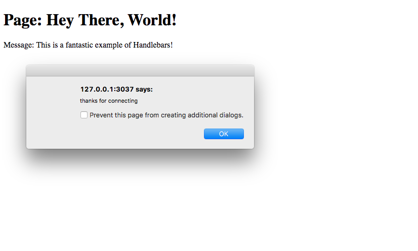

# Chapter 4.5 - WebSockets

We use WebSockets to easily communicate between the front-end of the website
and the back-end. Let's say, for example, our user is on the website and has a
list of items to choose from. When the user selects an item, we use WebSockets
to tell the back-end that the item should be sent to the person. However, we'll
also need to do some checks on the back-end to make sure the message from the
front-end is legitimate, and not spoofed by a user to try to get extra items.
We'll get into this more later, but for now just remember not to trust the
messages from the front-end unless they've been verified.

Let's copy our `project5` code from Chapter 4.3 to a new folder which we'll
title `project8`. Then we'll edit our `app.js`.

```js
// app.js

const express = require('express');
const handlebars = require('express-handlebars');
const path = require('path');
const http = require('http');
const socket = require('socket.io')

const app = express();
const server = http.Server(app);
const io = socket(server);
const hbs = handlebars.create();

app.engine('hbs', hbs.engine);
app.set('views', path.join(__dirname, 'views'));
app.set('view engine', 'hbs');

app.get('/', (req, res) => {
	res.render('main', {
		title: 'Hey There, World!',
		message: 'This is a fantastic example of Handlebars!'
	});
});

io.on('connection', (socket) => {
	console.log('a user connected');
	socket.emit('welcome', 'thanks for joining');
});

server.listen(3037);
```

Okay – a lot of changes in this first code block. First we imported Node.js's
built-in HTTP module, which gives us more control over our server. We created a
new server using our Express app by using `http.Server(app)`. We also imported
our `socket.io` module and created a new Socket.io handler bound to our HTTP
server. This allows us to access the `/socket.io/socket.io.js` route for the
client-side Socket.io code which we'll use in a bit. It also allows us to use
the same port as the server is hosted on instead of using up two ports – one
for the server and one for Socket.io. When a user connects to our Socket.io
server, we emit a welcome message with the content "thanks for joining". Then,
we'll use that message on the front-end to alert the user.

Now we'll fix up out HTML in `main.hbs`:

```html
<!-- main.hbs -->

<!DOCTYPE html>
<html>
	<head>
		<title>{{title}}</title>
	</head>
	<body>
		<h1>Page: {{title}}</h1>
		Message: {{message}}
	</body>

	<script src="/socket.io/socket.io.js"></script>
	<script>
		var socket = io();

		socket.on('welcome', function(msg) {
			alert(msg);
		});
	</script>
</html>
```

All we did here was import our client-side Socket.io code from
`/socket.io/socket.io.js` and initialized a new connection using `io()`. We
also began listening for a `welcome` message and alert the user when one is
received.

When we try this, an alert should be created with the message "thanks for
joining".



We'll be using WebSockets to work with trades in our final project. When a user
selects a trade and clicks submit, the front-end will send a message to the
back-end, which will then send the trade offer.
