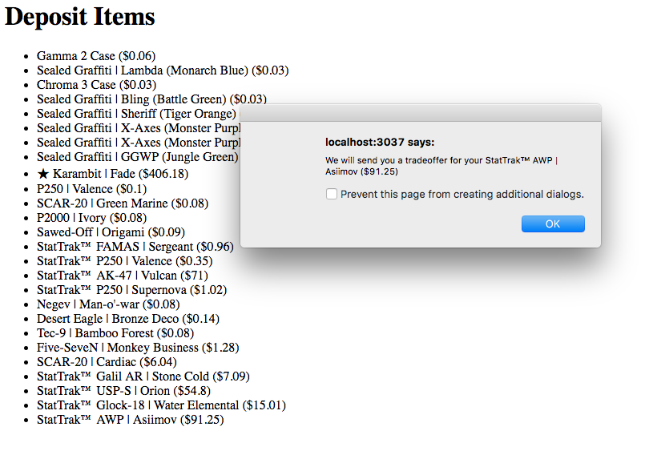
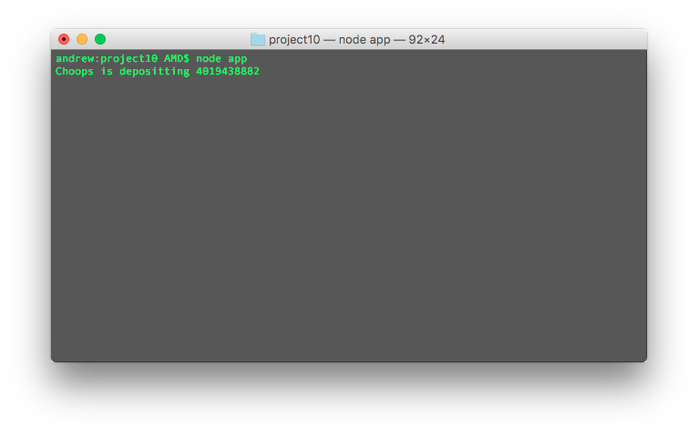

# Chapter 6.2 - Getting Started

<a target='_blank' rel='nofollow' href='https://app.codesponsor.io/link/WWKSZ8BufMHxCu7dPGG4np4x/andrewda/node-steam-guide'>
  
</a>

Our application is certainly going to need authentication, so we'll use our
code from 
[Chapter 5.2](../../Chapter%205%20-%20Advanced%20Web%20Development/Chapter%205.2%20-%20Authentication) 
for the base. Call this new folder `project10`. Then we'll add a couple 
templates using Handlebars. First let's create a couple new views: `deposit
.hbs` and `withdraw.hbs`:

```html
<!-- deposit.hbs -->

<!DOCTYPE html>
<html>
	<head>
		<title>Deposit</title>
	</head>
	<body>
		<h1>Deposit Items</h1>
		<ul>
			{{#each items}}
			<li class="deposit item" data-assetid="{{this.assetid}}">{{this.name}} (${{this.price}})</li>
			{{/each}}
		</ul>
	</body>

	<script src="https://code.jquery.com/jquery-3.1.1.min.js"></script>
	<script src="/socket.io/socket.io.js"></script>
	<script src="/main.js"></script>
</html>
```

```html
<!-- withdraw.hbs -->

<!DOCTYPE html>
<html>
	<head>
		<title>Withdraw</title>
	</head>
	<body>
		<h1>Withdraw Items</h1>
		<ul>
			{{#each items}}
			<li class="withdraw item" data-assetid="{{this.assetid}}">{{this.name}} (${{this.price}})</li>
			{{/each}}
		</ul>
	</body>

	<script src="https://code.jquery.com/jquery-3.1.1.min.js"></script>
	<script src="/socket.io/socket.io.js"></script>
	<script src="/main.js"></script>
</html>
```

Then we'll change our `main.hbs`:

```html
<!-- main.hbs -->

<!DOCTYPE html>
<html>
	<head>
		<title>Steam Trades</title>
	</head>
	<body>
		{{#if user}}
		<h1>Welcome, {{user.personaname}}!</h1>
		<h3>You have {{#if user.credits}}{{user.credits}}{{else}}0{{/if}} credits</h3>
		<a href="/deposit">Deposit</a>
		<br />
		<a href="/withdraw">Withdraw</a>
		<br /><br />
		<a href="/logout">Logout</a>
		{{else}}
		<a href="/auth/steam">Click here to login</a>
		{{/if}}
	</body>

	<script src="https://code.jquery.com/jquery-3.1.1.min.js"></script>
	<script src="/socket.io/socket.io.js"></script>
	<script src="/main.js"></script>
</html>
```

Now our templates are complete, but we should create our `main.js` file in
order to tell the back end when items are clicked. Create a new directory named
`public` and create a `main.js` file inside of it:

```js
// main.js

var socket = io();

$(function() {
	$('.deposit.item').click(function(one, two) {
		socket.emit('deposit', {
			assetid: $(this).data('assetid')
		});

		alert('We will send you a tradeoffer for your ' + $(this).text());
	});

	$('.withdraw.item').click(function(one, two) {
		socket.emit('withdraw', {
			assetid: $(this).data('assetid')
		});

		alert('We will send you a tradeoffer with a ' + $(this).text());
	});
}());
```

Alright, cool. This should be all the client-side JS we need for now. When a
user clicks on an item, we'll emit an event to the server telling it that we
want to either deposit or withdraw an item.

To make this all work, we're going to need to make some additions to our
server-side code as well. This code is going to be pretty long, so we're going
to go ahead and break it into different sections. Each section will be in
sequential order, but if you get a little lost, check out the full code in the
`project10` directory here.

Before starting our `app.js`, though, let's make a new directory called
`helpers` and create a `priceUpdater.js` file. We'll use this to update prices
periodically. You can use whatever service you would like to update prices, but
we're going to keep it simple and use CSGOFast's API (which may not be
completely up-to-date).

```js
// priceUpdater.js

const _ = require('lodash');
const request = require('request');

const Price = require('../models/price');

module.exports = (interval) => {
	update();

	setInterval(update, interval);
};

function update() {
	request('https://api.csgofast.com/price/all', (err, response, body) => {
		if (err) {
			console.log(err);
		} else {
			let json = {};

			try {
				json = JSON.parse(body);
			} catch (e) {
				console.log(e);
			}

			_.forOwn(json, (price, market_hash_name) => {
				Price.update({ market_hash_name }, {
					$set: { price }
				}, { upsert: true }, (err) => {
					if (err) {
						console.log(err);
					}
				});
			});
		}
	});
}
```

Here, we're making use of `lodash` to iterate through the object of prices we
receive back from CSGOFast, then update them in the database.

We're also going to need some more database models in the `models` directory.
We'll create three new models: `inventory.js` for the user's inventory,
`item.js` for all the bot's items, and `price.js` to keep track of all the
prices.

```js
// inventory.js

const mongoose = require('mongoose');

module.exports = mongoose.model('Inventory', {
    steamid: String,
	updated: Number,
	items: [
        {
            market_name: String,
            assetid: String,
            image: String,
            price: Number
        }
    ]
});
```

```js
// item.js

const mongoose = require('mongoose');

module.exports = mongoose.model('Item', {
    market_hash_name: String,
    assetid: String,
    image: String,
    price: Number
});
```

```js
// price.js

const mongoose = require('mongoose');

module.exports = mongoose.model('Price', {
	market_hash_name: String,
	price: Number
});
```

Now comes the good stuff. Let's start editing our `app.js` file. In a future
section, we'll break this down into more files, but for now it will stay pretty
large.

Here, we'll start by importing our modules and initializing them.

```js
// app.js

const express = require('express');
const handlebars = require('express-handlebars');
const session = require('express-session');
const cookieParser = require('cookie-parser')
const passportSocket = require('passport.socketio');
const async = require('async');
const passport = require('passport');
const SteamStrategy = require('passport-steam').Strategy;
const path = require('path');
const mongoose = require('mongoose');
const http = require('http');
const socket = require('socket.io');
const MongoStore = require('connect-mongo')(session);
const SteamCommunity = require('steamcommunity');

const Inventory = require('./models/inventory');
const Item = require('./models/item');
const User = require('./models/user');
const Price = require('./models/price');

const priceUpdater = require('./helpers/priceUpdater');

const app = express();
const server = http.Server(app);
const io = socket(server);
const hbs = handlebars.create();
const community = new SteamCommunity();
const sessionStore = new MongoStore({ mongooseConnection: mongoose.connection });
```

Obviously we're going to be using many modules here. The uses of each new one
will become evident once they get used.

Next, we'll set up our connection to the MongoDB database, set up our price
updater, and configure Passport as we did in the previous Chapter.

```js
// app.js (cont.)

mongoose.connect('mongodb://127.0.0.1:27017/guide');
priceUpdater(6 * 60 * 60 * 1000);

passport.serializeUser((user, done) => {
	User.update({
		steamid: user.id
	}, {
		$set: user._json
	}, { upsert: true }, (err) => {
		done(err, user._json);
	});
});

passport.deserializeUser((obj, done) => {
	User.findOne({
		steamid: obj.steamid
	}, (err, user) => {
		done(err, user);
	});
});

passport.use(new SteamStrategy({
		returnURL: 'http://localhost:3037/auth/steam/return',
		realm: 'http://localhost:3037/',
		apiKey: 'your Steam API key'
	}, (identifier, profile, done) => {
		return done(null, profile);
	}
));
```

The Passport configuration should look pretty familiar – it has hardly changed
since when we last used it. One part that has changed a little bit, though, it
that we added a connection to the database in `serializeUser` and
`deserializeUser` which will make our `req.user` object contain more
information (most notably credits).

Next we should configure our Socket.io server. This might look a little new:

```js
// app.js (cont.)

io.use(passportSocket.authorize({
	cookieParser: cookieParser,
	key: 'U_SESSION',
	secret: 'some secret string',
	store: sessionStore
}));

io.on('connection', (socket) => {
	socket.on('deposit', (data) => {
		const user = socket.request.user;
		console.log(`${user.personaname} is depositting ${data.assetid}`);
		// we'll send the trade offer here
	});

	socket.on('withdraw', (data) => {
		const user = socket.request.user;
		console.log(`${user.personaname} is withdrawing ${data.assetid}`);
		// we'll send the trade offer here
	});
});
```

First we tell Socket.io to use `passport-socket`, a module to help identify
users connecting over Socket.io. For example, if Jill makes a Socket.io request
telling us that she wants to deposit items, we want to make sure it really is
Jill and not Steve pretending to be Jill. This is exactly what
`passport-socket` does. We need to pass it the same parameters as we pass our
`express-session` below, so make sure the `key` matches the `name` below, and
both `secret`s match.

We also create a listener for each incoming connection that listens for the
`deposit` and `withdraw` events, and logs to the console the person who is
looking to `deposit` or `withdraw` items. In a future section, we'll use this
space to tell our bot to send a trade offer to the specified user.

Now we'll configure our Express app:

```js
// app.js (cont.)

app.engine('hbs', hbs.engine);
app.set('views', path.join(__dirname, 'views'));
app.set('view engine', 'hbs');

app.use(session({
    secret: 'some secret string',
    name: 'U_SESSION',
    resave: true,
    saveUninitialized: true,
	store: sessionStore
}));

app.use(passport.initialize());
app.use(passport.session());
app.use(express.static('public'));
app.use(cookieParser());
```

Again, this should look pretty familiar. We added `express.static('public')`
which serves our `public` folder statically, but that's about the only
difference from previous chapters.

Finally we'll add our routes and start the server. This might be a little
overwhelming at first, but you should be able to grasp it.

```js
// app.js (cont.)

app.get('/', (req, res) => {
	res.render('main', {
		user: req.user
	});
});

app.get('/deposit', (req, res) => {
	if (req.user) {
		Inventory.findOne({
			steamid: req.user.steamid
		}, (err, inv) => {
			if (inv && (Date.now() - inv.updated) > 30 * 60 * 1000) {
				res.render('deposit', {
					user: req.user,
					items: inv.items
				});
			} else {
				community.getUserInventoryContents(req.user.steamid, 730, 2, true, (err, inv) => {
					if (err) {
						console.log(err);
					} else {
						async.map(inv, (item, done) => {
							Price.findOne({
								market_hash_name: item.market_hash_name
							}, (err, doc) => {
								item.price = doc ? doc.price : '?';
								done(null, item);
							});
						}, (err, results) => {
							Inventory.update({
								steamid: req.user.steamid
							}, {
								$set: {
									updated: Date.now(),
									items: results
								}
							}, (err) => {
								if (err) {
									console.log(err);
								}
							});

							res.render('deposit', {
								user: req.user,
								items: results
							});
						});
					}
				});
			}
		});
	} else {
		res.redirect('/auth/steam');
	}
});

app.get('/withdraw', (req, res) => {
	if (req.user) {
		Item.find({}, (err, inv) => {
			async.map(inv, (item, done) => {
				Price.findOne({
					market_hash_name: item.name
				}, (err, doc) => {
					item.price = doc ? doc.price : '?';
					done(null, item.toObject());
				});
			}, (err, results) => {
				res.render('withdraw', {
					user: req.user,
					items: results
				});
			});
		});
	} else {
		res.redirect('/auth/steam');
	}
});

app.get(/^\/auth\/steam(\/return)?$/,
	passport.authenticate('steam', { failureRedirect: '/' }),
	(req, res) => {
		res.redirect('/');
	});

app.get('/logout', (req, res) => {
	req.logout();
	res.redirect('/');
});

server.listen(3037);
```

Ok – let's start off by walking through our `/deposit` route. When a user
navigates to `/deposit`, we begin by making sure the user is logged in (they
need to be logged in to deposit items, after all). Then, if they are logged in,
we try to find their inventory in our database, as long as it's up-to-date
(which, in our case, means being updated within the last 30 minutes). If we
find the user's inventory in our database and it's up to date, great, we server
the page with the items. Otherwise, we `node-steam-community` to request the
user's inventory from Steam, update the database, and serve the page.

The only other new route we added here is the `/withdraw` route. Here, we
verify that the user is logged in, then serve all the items in the `Items`
collection in our database. For now, there are probably no items there, but
we'll make sure the bot starts updating the database in the next section.

You can go ahead and test this out by starting MongoDB and running
`node app.js`. Visit http://127.0.0.1:3037 and give it a go!

Your `/deposit` page should look something like this:



And your console should have a message in it like this after clicking an item:



[Continue Reading](../Chapter%206.3%20-%20Beginning%20the%20Connection)
